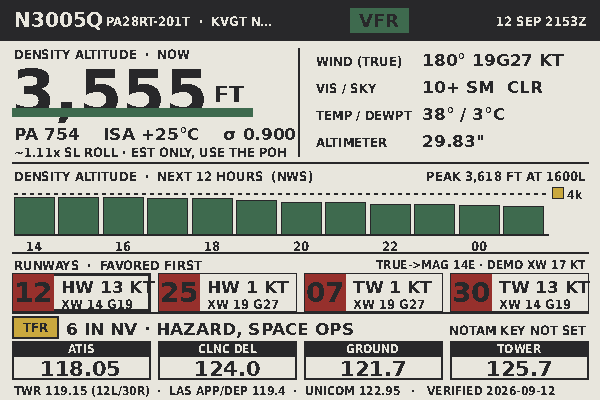

# N3005Q flight board

A 4" color e-ink preflight card for KVGT, running on an M5Stack M5Paper Color.
Density altitude now and through the day, crosswind components for every
runway end, active TFRs, and the field's comm frequencies.



## How it is put together

The device is a thin client. A GitHub Action renders a 600x400 six-color PNG
every 30 minutes and force-pushes it to the `output` branch; Vercel serves it;
the panel wakes, fetches it, paints it, and sleeps.

```
GitHub Actions cron ──> render/render.py ──> public/card.png (12 KB)
                                                   │
                                      force-push to branch `output`
                                                   │
                                            Vercel CDN (HTTPS)
                                                   │
                              M5Paper Color: GET, drawPng, deep sleep
```

The split exists because the panel refresh is 15 to 30 seconds and cannot do
partial updates. Everything expensive is therefore pushed off the device, and
the device only repaints when the bytes actually changed.

The alternative, parsing METAR and the 162 KB NWS forecast on the ESP32, is
possible with an ArduinoJson filter and the 8 MB of PSRAM. It was rejected
because every layout tweak would mean a recompile and a reflash, and because
three separate TLS endpoints on a battery device is three things to go wrong
at 3am.

## Data sources

| What | Source | Auth | Notes |
|---|---|---|---|
| METAR | aviationweather.gov | none | Hard dependency. CI fails if it fails. |
| DA forecast | api.weather.gov hourly | none | Needs a User-Agent header. |
| TFRs | tfr.faa.gov | none | State-filtered only; the feed has no coordinates, so it cannot tell you a TFR is *near* you. |
| NOTAMs | FAA NOTAM API | **client_id/secret** | Free key from api.faa.gov. Blank means the card shows "NOTAM KEY NOT SET". |
| Frequencies | OurAirports (CC0) | none | Static config, refreshed by hand. See caveat below. |
| Fuel price | none exists | n/a | No free API. Manual config field or nothing. |

### Caveats worth knowing

- **Frequencies are community data.** OurAirports was missing tower 119.15,
  the alternate the FAA Chart Supplement lists for 12L/30R. It is added by
  hand in `config.json` and there is a note there to re-add it after any
  refresh. Verify against the Chart Supplement before relying on any of this
  in the airplane.
- **Ground roll is an estimate.** `~1.11x SL roll` is a constant-thrust
  approximation appropriate to a turbocharged engine below its critical
  altitude. It is not POH data and the card says so. Plan with the book.
- **The DA forecast holds the current altimeter constant** across 12 hours.
  Temperature dominates density altitude by a wide margin, so the error is
  roughly ±100 ft.
- **The crosswind limit is a config value**, not a certificated limit.
- **METAR wind is true-referenced; runway numbers are magnetic.** The code
  corrects for 14°E at KVGT. Skipping that is a 2.5 kt error in the crosswind
  component.
- **GitHub's cron is best-effort** and routinely runs late. The device
  therefore checks `Last-Modified` and overlays a STALE banner rather than
  trusting that the job fired.

## Setup

### 1. Repo and CI

Push this to a repo. The workflow needs nothing to run, but for NOTAMs add
repo secrets `FAA_CLIENT_ID` and `FAA_CLIENT_SECRET` from api.faa.gov.

Run it once manually from the Actions tab to create the `output` branch.

Note that scheduled workflows are disabled automatically after 60 days of
repository inactivity. If the card goes stale for no obvious reason, check
that first.

### 2. Vercel

Point a Vercel project at this repo with **production branch `output`** and
output directory `public`. The card lands at
`https://<project>.vercel.app/card.png`, with `status.json` beside it for
debugging.

### 3. Firmware

```
cp firmware/n3005q_board/config.h.example firmware/n3005q_board/config.h
```

Fill in wifi credentials and `CARD_URL`. `config.h` is gitignored; do not
commit it.

```
cd firmware
pio run -t upload
pio device monitor
```

Board settings come from M5Stack's PaperColor documentation: ESP32-S3R8,
`qio_opi` memory type, 16 MB flash, `default_16MB.csv` partitions.

TLS uses the ESP32 core's bundled Mozilla root store rather than a pinned
CA, so a certificate rotation at the host does not brick the device.

## Power

Specs are 92.53 µA standby and 211.97 mA full load, on a 1250 mAh cell.

| | per wake |
|---|---|
| 304, no repaint | ~0.17 mAh (about 5s of radio) |
| 200, full repaint | ~1.4 mAh (5s radio + ~25s panel) |

At 30 minute wakes from 05:00 to 21:00 and 2 hours overnight, that is 36
wakes a day. If most of them repaint, expect roughly **3 weeks**; if the
METAR only changes hourly and the rest return 304, closer to **4 to 5 weeks**.

The dominant lever is repaint frequency, not wake frequency. Moving
`DAY_INTERVAL_MIN` from 30 to 60 roughly doubles endurance. If the panel sits
on a desk near a USB-C charger, none of this matters.

## Failure behaviour

The design principle is that e-ink holds its last image at zero power, so a
stale-but-correct card beats a blank one.

| Situation | What happens |
|---|---|
| Wifi fails | Panel untouched, retry in 5 min. After 3 consecutive failures, repaint with NO WIFI. |
| Fetch fails | Same. |
| Server returns 304 | No repaint at all. Straight back to sleep. |
| Image older than 150 min | Card is painted with a yellow STALE banner. |
| METAR fetch fails in CI | Job fails loudly. Nothing is published, so the device keeps the last good card. |
| NWS or TFR fails in CI | Card still publishes; the failure is recorded in `status.json.errors`. |

## Layout

```
0-40    header: tail, type, station, battery slot, flight category, obs time
46-158  density altitude now  |  current weather
168-248 density altitude, next 12 hours
257-306 runways, favored first, with wind components
316-338 TFR / NOTAM line
341-397 frequencies (or currency chips, per config `bottom_band`)
```

The header's battery box at x292-344 is deliberately left black by the
renderer. The firmware draws the battery percentage into it after decoding
the PNG, because the server has no way to know it.

## Development

```
cd render
python3 render.py          # writes ../public/
python3 verify.py          # 15 checks, exits nonzero on failure
python3 tools/fetch_freqs.py KVGT   # refresh frequencies from OurAirports
```

`verify.py` cross-checks density altitude three ways (the NWS closed form the
renderer uses, the ideal gas law from first principles, and the pilot rule of
thumb), checks the image contains only the six legal Spectra 6 inks, and
confirms nothing is clipped at the panel edge.

### One hard-won rendering note

10px regular text does not survive six-color quantization. Pillow
anti-aliases glyphs to gray, the snap-to-palette has no dithering, and thin
strokes come apart into noise. **12px condensed bold is the practical floor.**
Chromatic coverage is also kept under 20% because refresh time scales with
color complexity.
